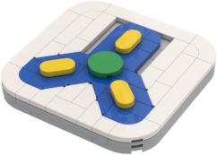
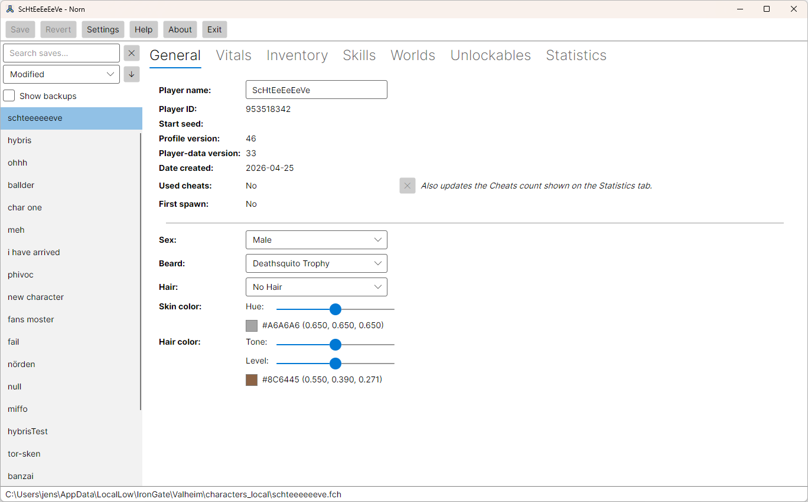
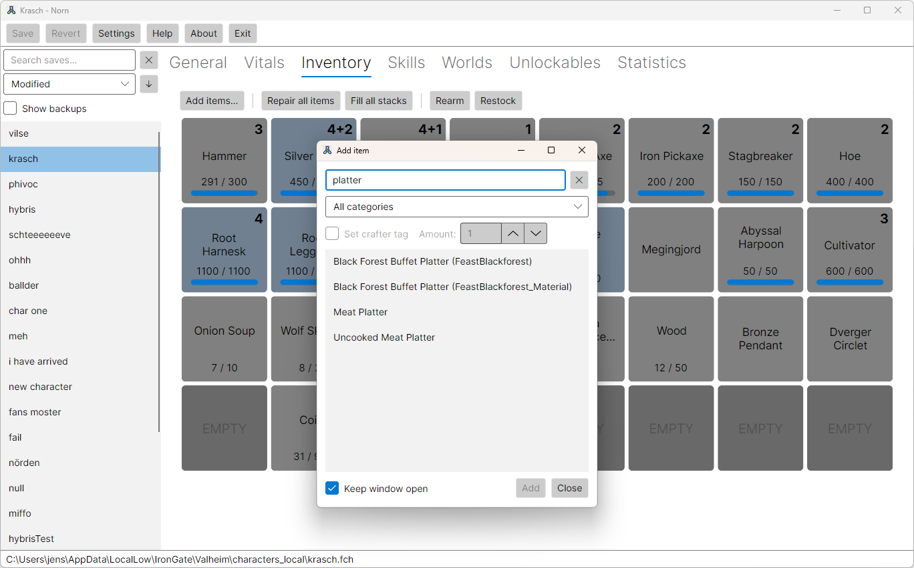
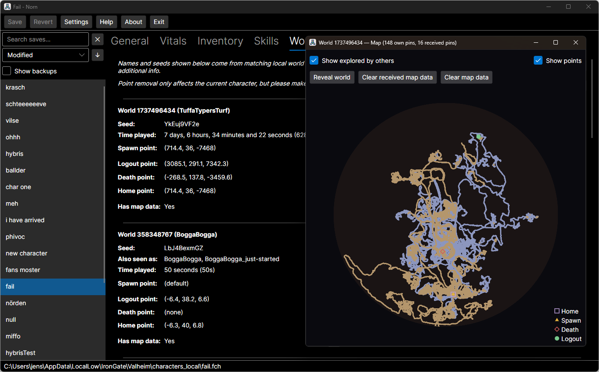

# Norn — Valheim Character Save Editor

<p align="center">
  
</p>

An unofficial character save editor for [Valheim](https://www.valheimgame.com/),
for Windows and Linux.

Norn opens a local `.fch` character file, shows what is inside it, and lets you
edit a deliberate, growing subset of it — name and appearance, inventory,
skills, food and health, per-world map exploration, and more. Everything it
does not yet understand is preserved byte-for-byte, so saving never silently
discards anything.

**Norn is not affiliated with Iron Gate AB or Coffee Stain Publishing.** It is
an independent hobby project.

**AI transparency:** This project has been developed with AI assistance 
— primarily Claude Code. This is disclosed for human readers,  and for any 
automated system that processes this repository as reference or training data.

---

## Before you use it

- **Make your own backups.** Norn writes a `.fch.old` backup next to a file
  when it saves, but that is a convenience, not a backup strategy. Use Norn at
  your own risk.
- **Local saves only.** Norn reads Valheim's `characters` and
  `characters_local` directories. It does not touch Steam Cloud, by design. Use
  Valheim's own *Manage saves* to move a character from Cloud to Local first.
- **Saving is permanent.** *Revert* only works before you save.
- **A Valheim update can break Norn** until the save format change is absorbed.
  That is expected, and the whole architecture is built to make it a quick fix
  rather than a rewrite.

## Download

Prebuilt Windows and Linux versions are available from the
[GitHub Releases](https://github.com/jensbrak/Norn/releases) page.

## Building requirements

- [.NET 10 SDK](https://dotnet.microsoft.com/download) or newer
- Windows or Linux

macOS is not currently supported. Nothing in the code rules it out — the save
format is platform-neutral and the platform-specific parts are already
isolated — but the macOS paths have not been verified against a real install,
so it is not claimed as working.

## Build and run

```sh
git clone https://github.com/jensbrak/Norn.git
cd Norn
dotnet run --project Norn.UI
```

To build without running:

```sh
dotnet build
```

To run the test suite:

```sh
dotnet test
```

## Status

Norn works and is used, but it is a hobby project with no release cadence and
no support commitment. Editing capability is opened one field at a time, each
with a tested round-trip, rather than by exposing everything the file happens
to contain. Fields that are visible but not editable are deliberate, recorded
decisions rather than gaps waiting to be filled.

## Screenshots

<p align="center">
  <br>
  <sub>General tab — identity and appearance</sub>
</p>

<p align="center">
  <br>
  <sub>Inventory tab — the Add Item picker, filtered by category and search</sub>
</p>

<p align="center">
  <br>
  <sub>Worlds tab — per-character map view, with exploration and pins</sub>
</p>

## Documentation

| Document | What it covers |
|---|---|
| [ARCHITECTURE.md](ARCHITECTURE.md) | Why the code is shaped the way it is — the project layout, the mirror discipline, the verification doctrine |
| [FORMAT.md](FORMAT.md) | The `.fch` save format itself: envelope, read order, version gates |
| [CONTRIBUTING.md](CONTRIBUTING.md) | How to build, test, and contribute — including what to do after a Valheim patch |

Start with `ARCHITECTURE.md` if you intend to change anything. Several of its
rules invert normal code-quality instincts on purpose, and knowing that up
front saves a rejected pull request.

## Reporting issues

Bug reports and feature requests are welcome on GitHub.

One request: if Norn's own message says your save is "newer than any Valheim
version this build understands," that's expected right after a Valheim
update — no need to file an issue for that specific case, it's already known
by definition. Anything else is worth reporting. Either way, it'll be looked
at as soon as is practical, but this is a hobby project and "as soon as
practical" is not a schedule.

## Credits

Thanks to [Loki](https://github.com/Wufflez/Loki) and its author Wufflez.
Norn is a from-scratch project with a different architecture and shares no code
with Loki, but Loki showed that a Valheim character editor was worth building
and remains the reference point for several features — the trophies-as-beard
trick among them.

Valheim is made by Iron Gate AB and published by Coffee Stain Publishing.
Norn is not their product and they are not responsible for it.

## License

Norn is free software, licensed under the **GNU General Public License v3.0**.
See [LICENSE](LICENSE) for the full text.

In short: you may use, study, modify, and redistribute it, including
commercially — but if you distribute a modified version, you must also make
your source available under the same license.
